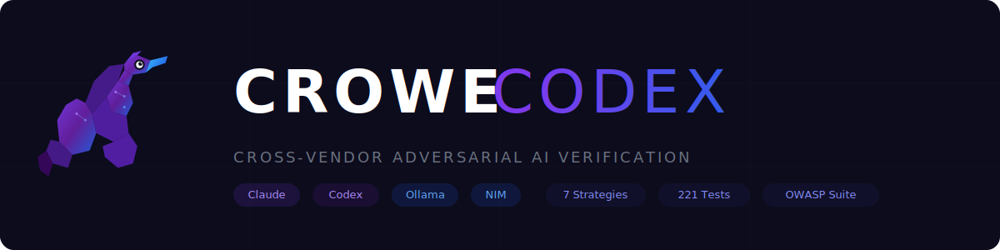

<p align="center">
  
</p>

<p align="center">
  <strong>Cross-vendor adversarial AI code verification engine.</strong><br/>
  OpenAI, Anthropic, NVIDIA, and your own models — adversarially verifying each other's output.<br/>
  No single company's blind spots make it to production.
</p>

<p align="center">
  <a href="https://github.com/MichaelCrowe11/crowe-codex/actions/workflows/ci.yml"></a>
  <a href="https://python.org"></a>
  <a href="LICENSE"></a>
  <a href="https://github.com/MichaelCrowe11/crowe-codex"></a>
</p>

## How It Works

crowe-codex orchestrates a **5-stage "Claude Sandwich" pipeline** where different AI vendors check each other's work:

```
Claude Architect (S1)  -->  Codex Builder (S2)  -->  DeepParallel Specialist (S3)
                                                              |
                                                              v
Claude Dispatch (S5)   <--  NVIDIA NIM Accelerator (S4) <----+
```

**Stage 1 — Claude Architect**: Plans the approach, defines constraints
**Stage 2 — Codex Builder**: Writes the implementation (GPT-powered)
**Stage 3 — DeepParallel Specialist**: Domain-specific review (Ollama/local models)
**Stage 4 — NVIDIA NIM Accelerator**: GPU-accelerated batch processing
**Stage 5 — Claude Dispatch**: Final merge, verification, and confidence scoring

## Install

```bash
pip install crowe-codex
```

## Quick Start

```bash
# Adversarial code synthesis (build/attack/fuzz cycles)
crowe-codex adversarial "implement rate limiter middleware"

# Cross-vendor consensus (compare outputs, merge best)
crowe-codex consensus "add input validation to user endpoint"

# Verification loop (one writes code, another writes tests)
crowe-codex verify "implement JWT authentication"

# Sequential pipeline (architect -> build -> review -> dispatch)
crowe-codex pipeline "refactor database connection pool"

# Cognitive mesh (all agents in parallel, merge best parts)
crowe-codex mesh "optimize image processing pipeline"

# Evolutionary generation (breed best code candidates)
crowe-codex evolve "implement concurrent task scheduler" -p 5 -g 3

# Auto-select best strategy for the task
crowe-codex auto "fix memory leak in worker pool"
```

## 7 Composable Strategies

| Strategy | Command | Description |
|----------|---------|-------------|
| **Adversarial** | `adversarial` | Build/attack/fuzz cycles with cross-vendor verification |
| **Consensus** | `consensus` | Same task through multiple agents, compare and merge |
| **Verification Loop** | `verify` | One writes code, another writes tests, cross-verify |
| **Pipeline** | `pipeline` | Sequential: architect -> build -> review -> dispatch |
| **Cognitive Mesh** | `mesh` | All agents in parallel, dispatch merges best parts |
| **Evolutionary** | `evolve` | Population-based, fitness-scored, breed best traits |
| **Adaptive Router** | `auto` | Learns which strategy works best per task type |

## SDK Usage

```python
import asyncio
from crowe_codex import DualEngine
from crowe_codex.strategies import Adversarial

engine = DualEngine()
result = asyncio.run(engine.run(Adversarial(rounds=2), task="implement rate limiter"))

print(result.confidence.score)             # 0-100
print(result.confidence.cross_vendor_agreement)  # 0.0-1.0
print(result.confidence.owasp_clean)       # True/False
```

## Security Suite

Full security toolchain built in — not bolted on:

```bash
# OWASP Top 10 cross-vendor scan
crowe-codex security-audit app.py --owasp --threats

# Supply chain verification (anti-slopsquatting)
crowe-codex verify-deps requests flask pydantic

# Compliance assessment (SOC2, HIPAA, PCI-DSS)
crowe-codex security-audit app.py -c soc2 -c hipaa
```

**What's included:**
- **OWASP Scanner** — Cross-vendor scanning for all OWASP Top 10 categories
- **Supply Chain Verifier** — Detects slopsquatting, typosquatting, and suspicious packages
- **Threat Model Engine** — STRIDE-based threat analysis with persistence and evolution
- **Compliance Mapper** — SOC2, HIPAA, PCI-DSS control assessment
- **Attestation Generator** — Scored security reports (0-100) with full audit trail

## Cloud & Team Features

```bash
# Browse the strategy marketplace
crowe-codex marketplace

# Team security dashboard
crowe-codex dashboard --team my-team
```

- **Cloud Routing Sync** — Teams share learned routing intelligence
- **Security Dashboard** — Track scores over time with trend analysis
- **Strategy Marketplace** — Browse, publish, and rate community strategies

## Fitness Engine

Every code candidate is scored across 5 dimensions:

| Dimension | Weight | What It Measures |
|-----------|--------|-----------------|
| Correctness | 35% | Does it work? Tests pass? |
| Robustness | 20% | Error handling, edge cases |
| Performance | 15% | Efficiency, resource usage |
| Readability | 15% | Clean code, documentation |
| Security | 15% | Vulnerability-free, safe patterns |

## Plugin System

Extend crowe-codex with custom strategies:

```python
# In your package's pyproject.toml
[project.entry-points."crowe_codex.strategies"]
my_strategy = "my_package.strategy:MyStrategy"
```

```python
from crowe_codex.strategies.base import Strategy

class MyStrategy(Strategy):
    name = "my_strategy"

    def stages_needed(self):
        return [1, 2, 5]  # Which pipeline stages to use

    async def execute(self, agents, task, **kwargs):
        # Your custom orchestration logic
        ...
```

## Configuration

Set your API keys:

```bash
export ANTHROPIC_API_KEY="sk-ant-..."    # Claude (Stages 1 & 5)
export OPENAI_API_KEY="sk-..."           # Codex (Stage 2)
export NVIDIA_NIM_API_KEY="nvapi-..."    # NIM (Stage 4, optional)
# Ollama runs locally — no key needed    # DeepParallel (Stage 3)
```

## Architecture

```
src/crowe_codex/
    core/           # Engine, agents (Claude, Codex, Ollama, NIM), pipeline
    strategies/     # 7 composable strategies + adaptive router
    security/       # OWASP, supply chain, threats, compliance, attestation
    fitness/        # Multi-dimensional code quality scoring
    cloud/          # Routing sync, dashboard, marketplace
    plugins/        # Entry-point based plugin system
    cli.py          # Click-based CLI with Rich output
```

## License

MIT
